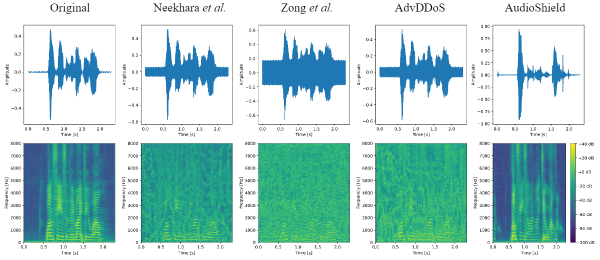

-- Disclaimer: This GitHub repository is under routine maintenance.

# AudioShield

This is the source code for AudioShield.

## Setup

To run the code, ensure the following dependencies are installed:

- Python == 3.8
- PyTorch == 2.2.2
- CUDA == 12.2

The required dependencies can be installed by running:

```bash
pip install -r requirements.txt
```

### Dataset

The `Librispeech` dataset can be downloaded from [here](https://www.openslr.org/12). The `dev-clean` subset is used in this implementation.

### Pre-trained Models

- The VITS model is used as the Autoencoder. The pre-trained model can be found [here](<https://drive.google.com/drive/folders/1ksarh-cJf3F5eKJjLVWY0X1j1qsQqiS2>).
- DeepSpeech2 is employed as the local target model. The implemented version is available [here](<https://github.com/SeanNaren/deepspeech.pytorch>).

## Train

### Preprocessing

- Execute `python data_preprocessing.py` to process the raw dataset.
- Navigate to the `datasets` folder and run `python librispeech.py` to process the latent code data.

### Training

- Return to the main directory and execute `python train.py --tgt_text "OPEN THE DOOR"` for a quick training session.
- Alternatively, the following command allows manual configuration of arguments:

```shell
python train.py \
	--training_iters <number_of_iterations> \
	--tau <tau_hyperparameter> \
	--device <device_type> \
	--tgt_text <target_text> \
	--output_dir <output_directory>
```

## Demo Audio Clips

Original Text: "I've not said anything to them, they know."

|                      Neekhara *et al.*                       |                        Zong *et al.*                         |                           AdvDDoS                            |                         AudioShield                          |
| :----------------------------------------------------------: | :----------------------------------------------------------: | :----------------------------------------------------------: | :----------------------------------------------------------: |
| <audio controls><source src="./demo/audio/neek_0.wav" type="audio/wav"></audio> | <audio controls><source src="./demo/audio/zong_0.wav" type="audio/wav"></audio> | <audio controls><source src="./demo/audio/adv_0.wav" type="audio/wav"></audio> | <audio controls><source src="./demo/audio/audioshield_0.wav" type="audio/wav"></audio> |
|           I've not said anything to them they know           |           Has not said anything to them they know            |           I've not said anything to them they know           |         No I don't know who had anything to do with          |

Original Text: "One season, they might do well."

|                      Neekhara *et al.*                       |                        Zong *et al.*                         |                           AdvDDoS                            |                         AudioShield                          |
| :----------------------------------------------------------: | :----------------------------------------------------------: | :----------------------------------------------------------: | :----------------------------------------------------------: |
| <audio controls><source src="./demo/audio/neek_1.wav" type="audio/wav"></audio> | <audio controls><source src="./demo/audio/zong_1.wav" type="audio/wav"></audio> | <audio controls><source src="./demo/audio/adv_1.wav" type="audio/wav"></audio> | <audio controls><source src="./demo/audio/audioshield_1.wav" type="audio/wav"></audio> |
|                 1 season they might do well                  |                      They might be well                      |                1 piece and you might be well                 |                       Most of the time                       |

## Visualization of Audio Examples

 

## Acknowledgement

Part of the implementation is built on [VITS](https://github.com/jaywalnut310/vits) and [DeepSpeech2](<https://github.com/SeanNaren/deepspeech.pytorch>). Acknowledgment goes to their outstanding contributions.

## License

This project is licensed under the MIT License. See the `LICENSE` file for more details.

